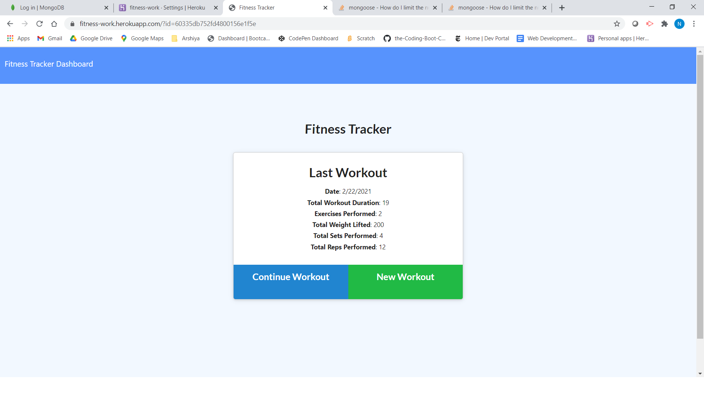
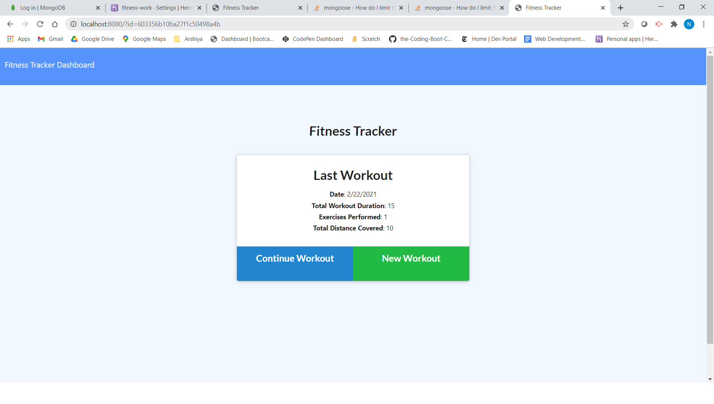
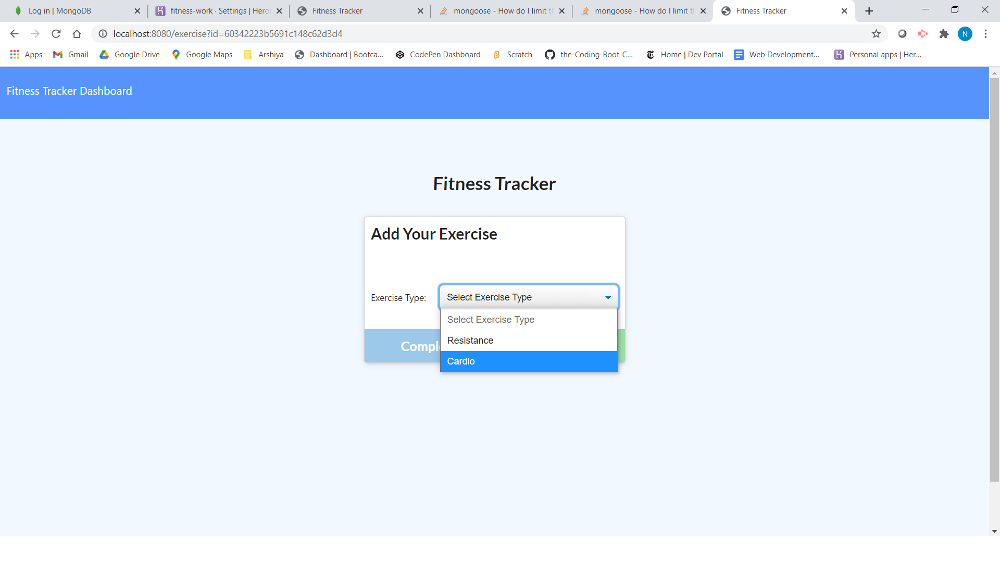
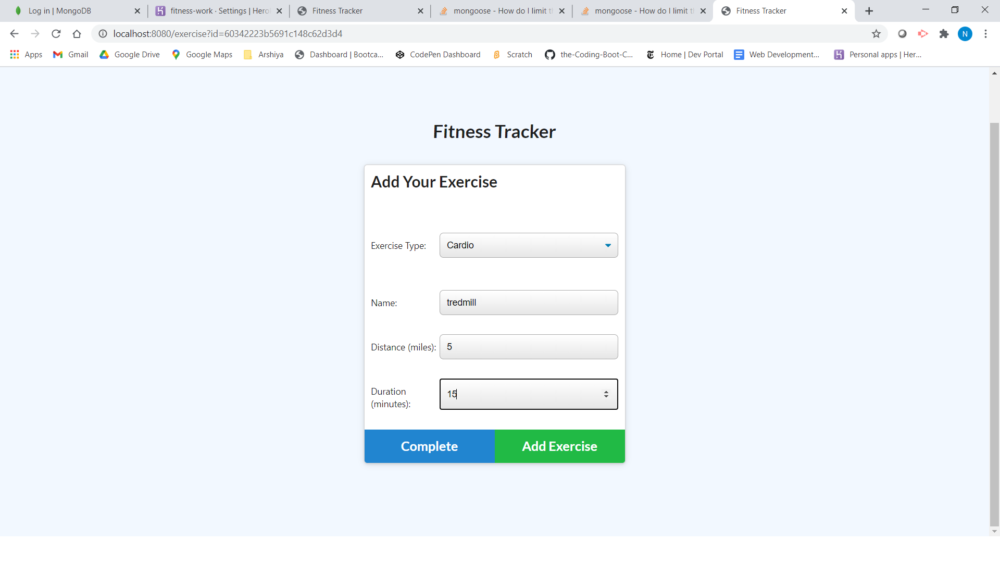
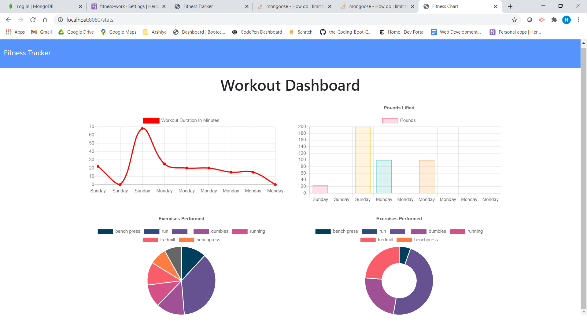

# ABOUT 

In this **application** , worked with **MONGODB**,made **collection**,**DB-NAME**,**PASSWORD** setting on **MONGODB-ATLAS** means user have to login in MONGODB ATLAS to work with .
and created the folder and file structure in **MVC** which stands for
**MODEL VIEW CONTROLLER**  and also deployed our application on **HEROKU**.
User can see all the **collections** and entered **exercises** in **ROBO 3T**.

# TABLE OF CONTENTS
[ DESCRIPTION](#DESCRIPTION)

[INSTALLATION](#INSTALLATION)

[TEXT-EDITOR](#TEXT-EDITOR)

[PROGRAMMING-LANGUAGE](#PROGRAMMING-LANGUAGE)

[RESOURCES-REFERRED](#RESOURCES-REFERRED)

[SCREENSHOT](#SCREENSHOT)

[GIT_HUB-REPOSITORY](#GIT_HUB-REPOSITORY)

[ HEROKU-LINK](#HEROKU-LINK) 

# DESCRIPTION

In this application , user will see the **FITNESS-TRACKER APP** by running
**node server.js** command on the terminal and listening to the port.
After,  connecting to the database, user will open the application in the browser
via **local host and the mentioned Port Number**. User will easily add the **WORKOUT**i.e **cardio**,**resistence** according to its liking by clicking on the **NEW WORKOUT** Button and also have the choice of **continue-workout** and **complete-workout** as well.When user choose from the exercise options, then they enter required options such as duration, time, reps , sets etc.Afterwords, user can click on **continue-workout** button or click on **complete workout** button.
When user, enter the complete workout button, will get the summary of entered exercise and its related details.I am adding the screenshot related to show this.

# INSTALLATION

**npm install MONGODB**
**npm install ROBO 3T**

## TEXT-EDITOR
**Vs-code**

## PROGRAMMING-LANGUAGE

CSS

JAVASCRIPT

HTML via HANDLEBARS

# RESOURCES-REFERRED
[MONGO-REFERENCE-addFIELDS](https://docs.mongodb.com/manual/reference/operator/aggregation/addFields/#pipe._S_addFields)

[MVC](https://www.tutorialspoint.com/mvc_framework/mvc_framework_introduction.htm)

[MONGO-HOW-TO-LIMIT](https://stackoverflow.com/questions/5830513/how-do-i-limit-the-number-of-returned-items)

# SCREENSHOT

# GIT_HUB-REPOSITORY
[GIT-HUB](https://github.com/nehreetkaur/fitness-tracker)

# HEROKU-LINK
[HEROKU-LINK](https://fitness-work.herokuapp.com/)

